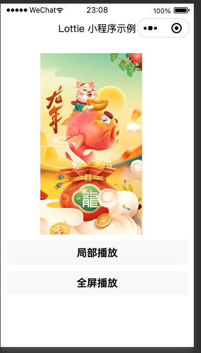

# 微信小程序-Lottie动画demo

相关文章：[小程序中使用 lottie 动画 | 踩坑经验分享](https://sugarat.top/technology/learn/mini-lottie.html)

## 使用

① 导入本项目到开发者工具

省略：。。。

② 安装依赖

```sh
npm install
```

③ 启动资源代理服务

```sh
npm run serve
```

点击页面中进行操作即可

## 效果

|        局部        |           全屏           |
| :----------------: | :----------------------: |
|  |  |

